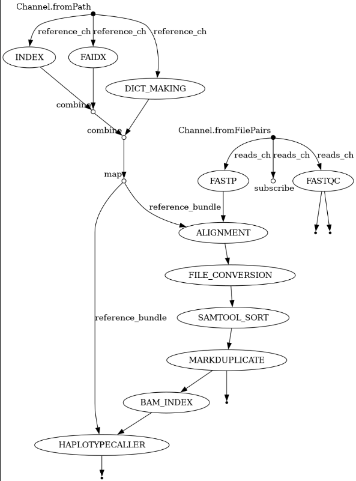
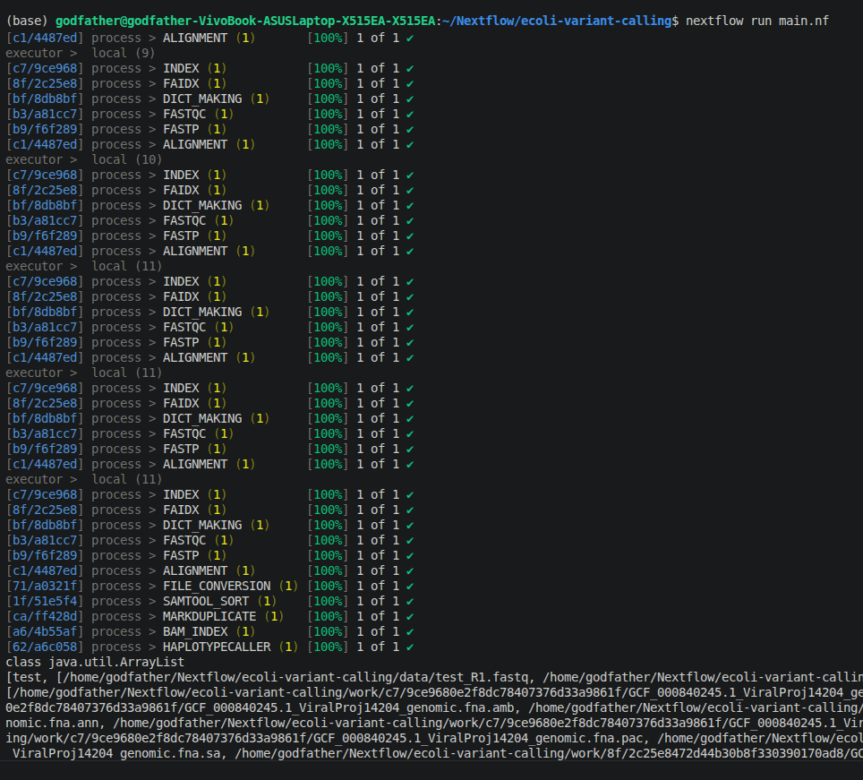
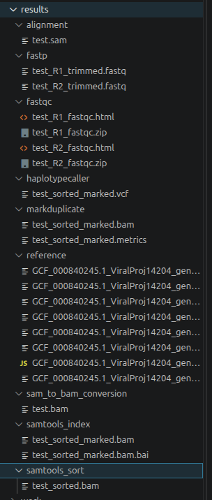
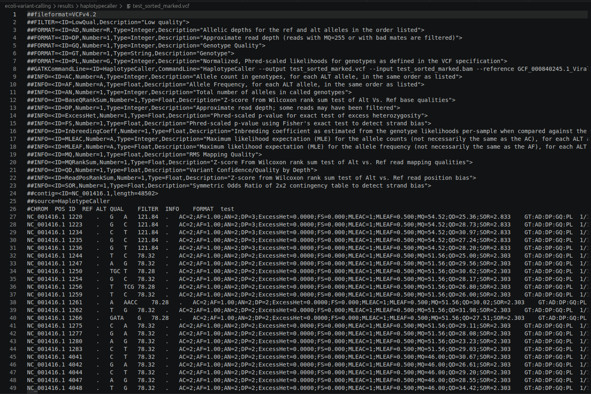

# 🧬 Nextflow Lambda Phage Variant Calling Pipeline


A modular **Nextflow DSL2** pipeline for **paired-end NGS variant calling** using **Docker containers**. The workflow follows a standard germline variant calling strategy, starting from raw paired-end FASTQ files and producing high-quality VCF files.

This project demonstrates workflow automation, reproducibility, containerization, and scalable bioinformatics pipeline development.

---

# Pipeline Overview

The pipeline performs the following steps:

```
Reference Genome
        │
        ▼
   BWA Index
        │
        ├──────────────┐
        ▼              ▼
    FASTA Index     Sequence Dictionary
        │              │
        └──────┬───────┘
               │
               ▼
        Reference Bundle

Paired-end Reads
       │
       ▼
     FASTQC
       │
       ▼
     FASTP
       │
       ▼
   BWA-MEM Alignment
       │
       ▼
   SAM → BAM
       │
       ▼
   BAM Sorting
       │
       ▼
 MarkDuplicates
       │
       ▼
    BAM Index
       │
       ▼
 GATK HaplotypeCaller
       │
       ▼
      VCF
```

---

# Workflow DAG

<p align="center">

</p>

---

# Features

- Paired-end sequencing support
- Nextflow DSL2 modular workflow
- Dockerized execution
- Automatic reference indexing
- FASTQC quality control
- FASTP adapter trimming
- BWA-MEM alignment
- SAMtools processing
- Duplicate marking
- BAM indexing
- Variant calling using GATK HaplotypeCaller
- Resume support using `-resume`
- Easily extendable for additional tools

---

# Tools Used

| Tool | Purpose |
|------|---------|
| Nextflow DSL2 | Workflow management |
| Docker | Containerization |
| FastQC | Read quality assessment |
| Fastp | Read trimming & filtering |
| BWA-MEM | Sequence alignment |
| Samtools | BAM processing |
| GATK | Variant calling |

---

# Project Structure

```
.
├── assets/
│   └── reference.fna
│
├── data/
│   ├── test_R1.fastq
│   └── test_R2.fastq
│
├── modules/
│   ├── alignment.nf
│   ├── bam_index.nf
│   ├── dict_making.nf
│   ├── faidx.nf
│   ├── fastp.nf
│   ├── fastqc.nf
│   ├── file_conversion.nf
│   ├── haplotypecaller.nf
│   ├── index.nf
│   ├── markduplicate.nf
│   └── samtool_sort.nf
│
├── screenshots/
├── results/
├── main.nf
├── nextflow.config
└── README.md
```

---

# Running the Pipeline

## Clone Repository

```bash
git clone https://github.com/yourusername/Nextflow-Lambda-Phage-Variant-Calling.git

cd Nextflow-Lambda-Phage-Variant-Calling
```

---

## Execute

```bash
nextflow run main.nf
```

Resume execution

```bash
nextflow run main.nf -resume
```

---

# Input

### Reference Genome

- Organism: **Escherichia phage Lambda**
- RefSeq Assembly: **GCF_000840245.1**

### Sequencing Reads

Paired-end FASTQ

```
sample_R1.fastq
sample_R2.fastq
```

---

# Output

The pipeline automatically creates

```
results/

alignment/
fastqc/
fastp/
sam_to_bam_conversion/
samtools_sort/
markduplicate/
samtools_index/
haplotypecaller/
reference/
```

---

# Example Results

## Pipeline Execution

<p align="center">

</p>

---

## Output Directory

<p align="center">

</p>

---

## Variant Calling Result

<p align="center">

</p>

---

# Workflow Design

The workflow is completely modular.

Each bioinformatics tool is implemented as an independent Nextflow process, allowing:

- easy maintenance
- tool replacement
- scalability
- reproducibility
- parallel execution

---

# Future Improvements

- MultiQC Integration
- Variant Filtering
- Variant Annotation (SnpEff / VEP)
- BCFtools Statistics
- Multi-sample Support
- AWS / HPC Deployment
- CI/CD Testing
- nf-core compatible structure

---

# Learning Objectives

This project demonstrates practical experience with:

- Nextflow DSL2
- Workflow Design
- Docker
- Linux
- Bioinformatics Pipeline Development
- NGS Data Processing
- GATK Best Practices
- Variant Calling
- Modular Software Engineering

---

# Author

**Rahul Kumar Singh**

M.Sc. Bioinformatics

GitHub:
https://github.com/rahuls472

LinkedIn:
(Add your LinkedIn)

---

# License

This project is released under the MIT License.
